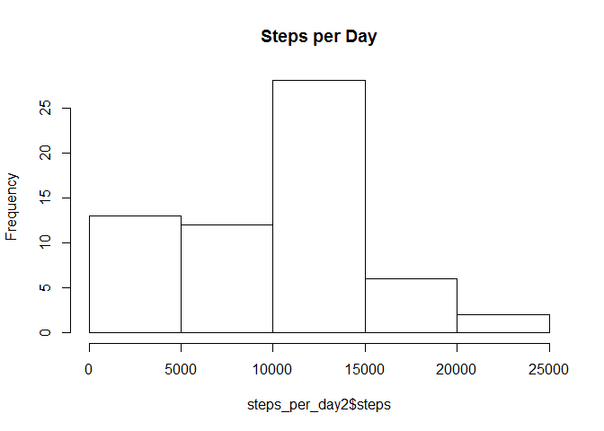
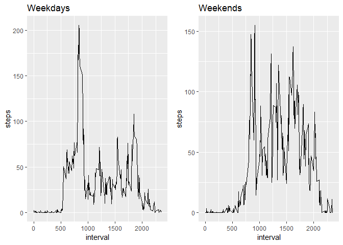

##Data Exploration on Steps per Day
This report will take a basic look at the steps taken by an individual over two months.

load libraries

```r
library(knitr)
library(dplyr)
```

```
## Warning: package 'dplyr' was built under R version 3.4.4
```

```
## 
## Attaching package: 'dplyr'
```

```
## The following objects are masked from 'package:stats':
## 
##     filter, lag
```

```
## The following objects are masked from 'package:base':
## 
##     intersect, setdiff, setequal, union
```

```r
library(ggplot2)
```

```
## Warning: package 'ggplot2' was built under R version 3.4.4
```

Code that sets echo=TRUE as default

```r
opts_chunk$set(echo=TRUE)
```

Code for loading data

```r
activity_data <- read.csv("repdata_data_activity/activity.csv")
```

We take a look at steps per day with a simple histogram

```r
steps_per_day <- aggregate(steps ~ date, data = activity_data, sum)
hist(steps_per_day$steps,
     main = "Steps per Day",
     xlab = "Steps")
```

<!-- -->


We may also be interested in the mean and median steps per day

```r
med_and_mean <- (paste("Mean Steps per day:", round(mean(steps_per_day$steps),2), "\nMedian Steps Per Day:", median(steps_per_day$steps)))
cat(med_and_mean)
```

```
## Mean Steps per day: 10766.19 
## Median Steps Per Day: 10765
```

```r
rm(steps_per_day)
```


Next we create a time Series plot of average number of steps taken

```r
steps_per_moment <- aggregate(steps ~ interval, data = activity_data, mean)
P <- ggplot(data = steps_per_moment, aes(x = interval, y = steps))
P + geom_line()
```

<!-- -->

```r
max_steps <- steps_per_moment[steps_per_moment$steps == max(steps_per_moment$steps),]
med_and_mean <- (paste("The moment during the day with the highest average steps was",
                       paste(substr(max_steps[1], 0, nchar(max_steps[1])-2),
                             ":",
                             substr(max_steps[1],nchar(max_steps[1])-1, nchar(max_steps[1])),
                             sep = ''),
                       #substr(max_steps[1],nchar(max_steps[1])-1, nchar(max_steps[1])),
                       "with",
                       round(max_steps[2], 2),
                       "steps per day"))
cat(med_and_mean)
```

```
## The moment during the day with the highest average steps was 8:35 with 206.17 steps per day
```

```r
rm(med_and_mean,
   max_steps,
   steps_per_moment,
   P)
```

The missing data points are bothersome, so we will be creating a new dataset that replaces them with the median for that interval over all days.

```r
#Count missing values
sum(is.na(activity_data$steps))
```

```
## [1] 2304
```

```r
#Come up with a strategy to deal with them.
steps_per_moment2 <- aggregate(steps ~ interval, data = activity_data, median)
altered_activity_data <- activity_data

fixmissing <- function(input) {
  if (is.na(input[1])) {
    #input[1] <- steps_per_moment2[as.integer(input[3]) == steps_per_moment2$interval, 2]
    #print(input[3])
    #print(steps_per_moment2[as.integer(input[3]) == steps_per_moment2$interval, 2])
    input[1] <- steps_per_moment2[as.integer(input[3]) == steps_per_moment2$interval, 2]
  }
  else {
    input[1]
  }
}

#Create a new dataset that has dealt with the problem
altered_activity_data[,1] <- as.integer(apply(activity_data, 1, fixmissing))
rm(activity_data,
   steps_per_moment2,
   fixmissing)
```

Now that we have imputed replacement data, we would like to see the histogram and averages again.

```r
#Find Mean and Median of the new dataset. Compare with old one. histogram, mean, and median.
steps_per_day2 <- aggregate(steps ~ date, data = altered_activity_data, sum)
hist(steps_per_day2$steps, main = "Steps per Day")
```

<!-- -->

```r
med_and_mean2 <- (paste("Mean Steps per day:", round(mean(steps_per_day2$steps),2), "\nMedian Steps Per Day:", median(steps_per_day2$steps)))
cat(med_and_mean2)
```

```
## Mean Steps per day: 9503.87 
## Median Steps Per Day: 10395
```

```r
rm(med_and_mean2,
   steps_per_day2)
```

Finally, we make a panel plot to compare average number of steps taken by 5min interval across weekends and weekdays.

```r
#group days into groups weekdays and weekends
weekend <- function(day){
  if (weekdays(as.POSIXct(day[2])) == "Saturday" | weekdays(as.POSIXct(day[2])) == "Sunday") {
    day[4] <- "weekend"
  }
  else {
    day[4] <- "weekday"
  }
  day[4]
}
altered_activity_data[,4] <- apply(altered_activity_data, 1, weekend)
names(altered_activity_data)[4] <- "weekend"

weekend.df <- altered_activity_data[altered_activity_data$weekend == "weekend",]
weekday.df <- altered_activity_data[altered_activity_data$weekend == "weekday",]

#Now for our plot
steps_per_weekday <- aggregate(steps ~ interval, data = weekday.df, mean)
P2 <- ggplot(data = steps_per_weekday, aes(x = interval, y = steps)) +
  geom_line() +
  ggtitle("Weekdays")

steps_per_weekend <- aggregate(steps ~ interval, data = weekend.df, mean)
P3 <- ggplot(data = steps_per_weekend, aes(x = interval, y = steps)) + 
  geom_line() +
  ggtitle("Weekends")

gridExtra::grid.arrange(P2, P3, nrow = 1)
```

<!-- -->

```r
rm(altered_activity_data,
   steps_per_weekday,
   steps_per_weekend,
   weekday.df,
   weekend.df,
   weekend,
   P2,
   P3)
```

